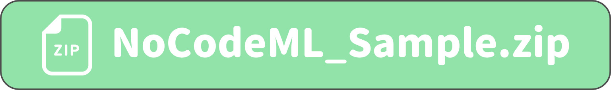

# 書籍「ノーコードではじめる機械学習」サポートページ

本リポジトリは、書籍「ノーコードではじめる機械学習」のサポートページです。

  

**特設サイト**  
 [https://nocode-ml.studio.site](https://nocode-ml.studio.site)  

## Amazon 製品ページ  
[電子書籍 (Kindle)](https://www.amazon.co.jp/dp/B09NLMPR8W)  
[紙書籍 (ペーパーバック)](https://www.amazon.co.jp/) ※準備中 (21'12/24より注文可)  

電子書籍版は、[楽天](https://a.r10.to/hwWD1Q)及び[BOOK☆WALKER](https://bookwalker.jp/de1172372b-f39a-4160-804d-91b9c4f9d558/?acode=1DRCLqyC)でもご購入いただけます。  

## 書籍紹介

本書は、プログラミング一切不要の「[Orange](https://orangedatamining.com/)」というソフトウェアを使用して、機械学習を使ったデータマイニングについて解説しています。  

 以下のような読者におすすめの一冊となっております。  

- プログラミングなしで、できるだけ簡単に機械学習を習得したい方  
- 機械学習を実務の現場で活用したいと考えている方  
- 以前、機械学習に挑戦したけれど挫折してしまった方  
- Pythonを使った機械学習から開放されたい方  
- 学校や勉強会などで機械学習の教材を検討している方  

本書は、初心者を対象にしているので、機械学習の知識がゼロからでもはじめられます。初心者向けに機械学習の基礎と実践をバランスよく最短距離で学べるように、できるだけ数式に頼らず、直感的に理解できるように心がけました。  

本書をきっかけに、機械学習の楽しさや、機械学習を業務で活用するお手伝いができれば幸いです。  

## 出版情報

2021 年 12 月 24 日 第 1 版（初版）発行  

## ダウンロード

本書で使用するサンプルファイル(CSVファイル)は、以下のリンクからダウンロードできます。 
 
  

ファイルはZIP形式で圧縮していますので、展開してからご利用ください。  

## リンク集

本書に記載しているウェブサイトのリンクは、[こちら](./Pages/URL.md)をご参照ください。  

## 補足情報

本書の補足情報は、[こちら](./Pages/SUPPL.md)をご参照ください。  
よくある質問と回答は、[FAQ](./Pages/FAQ.md)にまとめています。適時、ご参照ください。  

## 正誤情報

書籍の正誤表は、[こちら](./Pages/ERRATA.md)をご参照ください。  

## この本を共有
 
 
 
 
  
